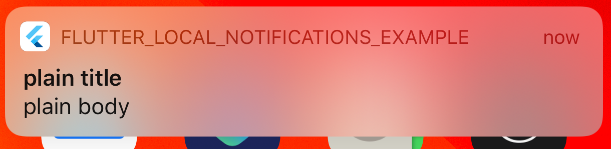

# How to setup Local Push Notification


## Setup 

The class `LocalNotifications` is Singleton, so to get an instance of this class you have to call:

```dart

final _localNotification = LocalNotifications.instance;

```
## Create a Notification 

There a two different kind of notification available.

The first way to create a notification is to call `showActionNotification()`, which takes a title, body and a defined action from the class `OnInteraction`.
For now `OnInteraction` only provides to open the gallery onTap. 

```dart
/// Displays a notification and selects an Action that happens on tap
  Future<void> showActionNotification(
      String title, 
      String body, 
      OnInteraction onInteraction,
    );
```

The other way to create a notification is to call `showRouteNotification()`, which takes a title, BuildContext and a own defined Route within the app. 

```dart
  /// Displays a notification and saves the route as a callback for execution on tap
 Future<void> showRouteNotification(
      String title, 
      String body, 
      Route route,
      BuildContext context,
 );
```

Here is an example how the notification will look:

## Android:


## iOS:

